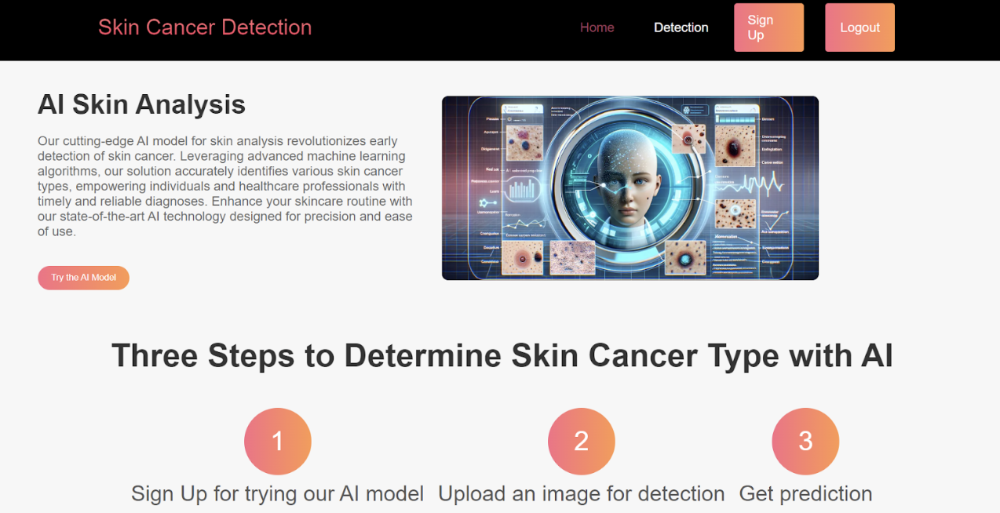
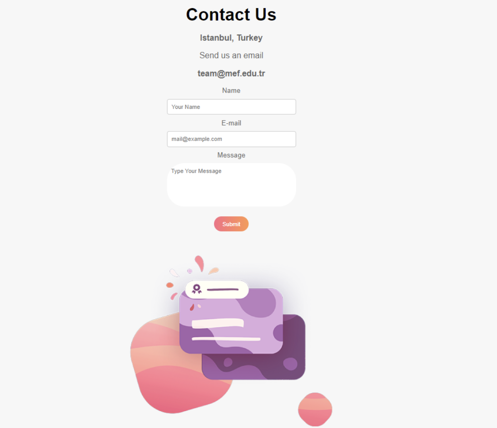
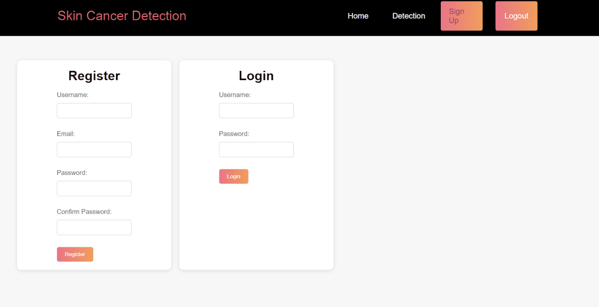
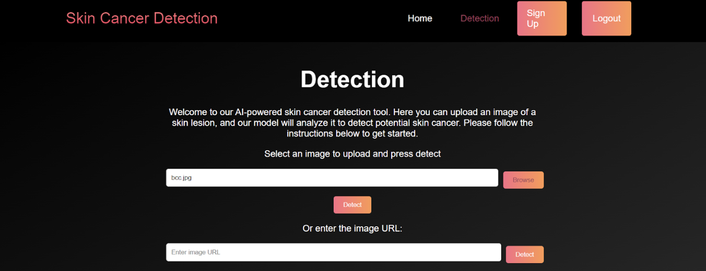
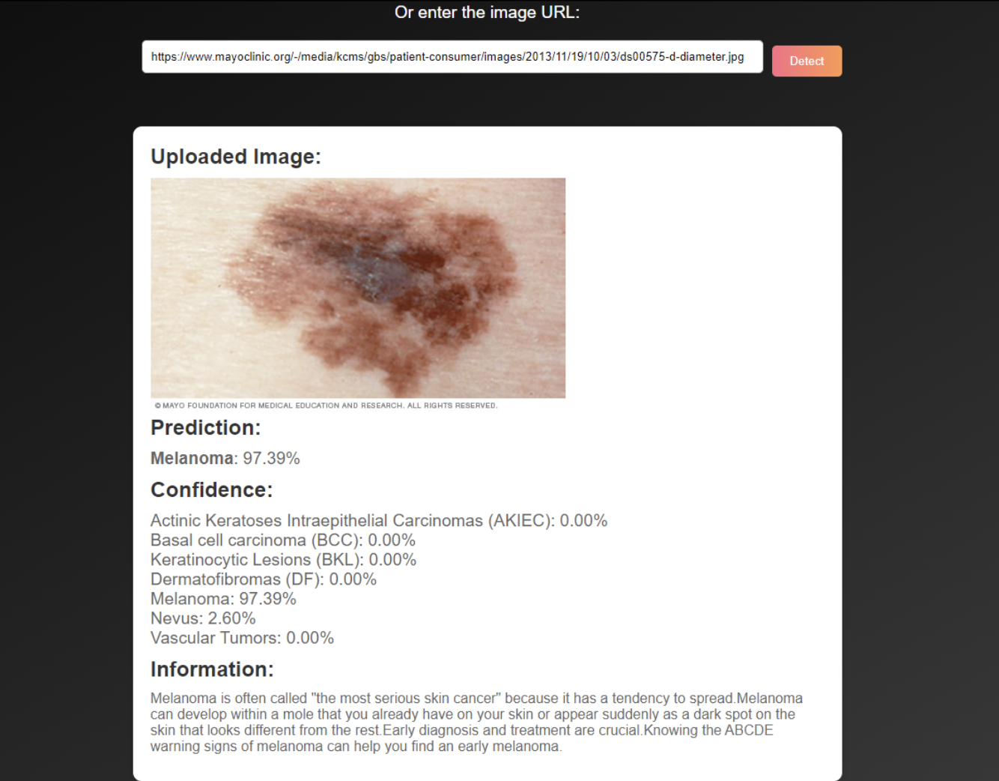

# Skin Cancer Detection Website
This project is a Flask web application integrated with a machine learning model for skin cancer type detection. This website includes user authentication and detection part from uploaded images or images accessible via url.

### Libraries:
**_Machine learning:_** Tensorflow-Keras for model creation and prediction. Also libraries such as numpy, pandas, opencv, matplotlib, PIL, requests and splitfolders has been used.

**_Flask:_** Web framework for building the API.

**_Authentication:_** Flask-JWT-Extended for JWT-based authentication.

### Model Setup:
**_EfficientNetB3:_** This pre-trained model used as the base.

**_ImageDataGenerator():_** Used for data augmentation and normalization.

**_EarlyStopping and ReducedLR0nPlateau:_** Included for optimization.

The data is preprocessed then the model is trained, evaluated and saved.

### Flask Application: 
**_Initialization:_** Configures the Flask app, initializes database, loads the trained model, and sets up JWT for authentication.

**_Blueprint:_** Defines routes within a blueprint for modular organization.

**_Register/Login:_** Handles user registration and login.

**_Detection:_** Handles image uploads and URL-based image processing for skin cancer detection, returning predictions with confidence percentage and detailed information.

---

# Output 

